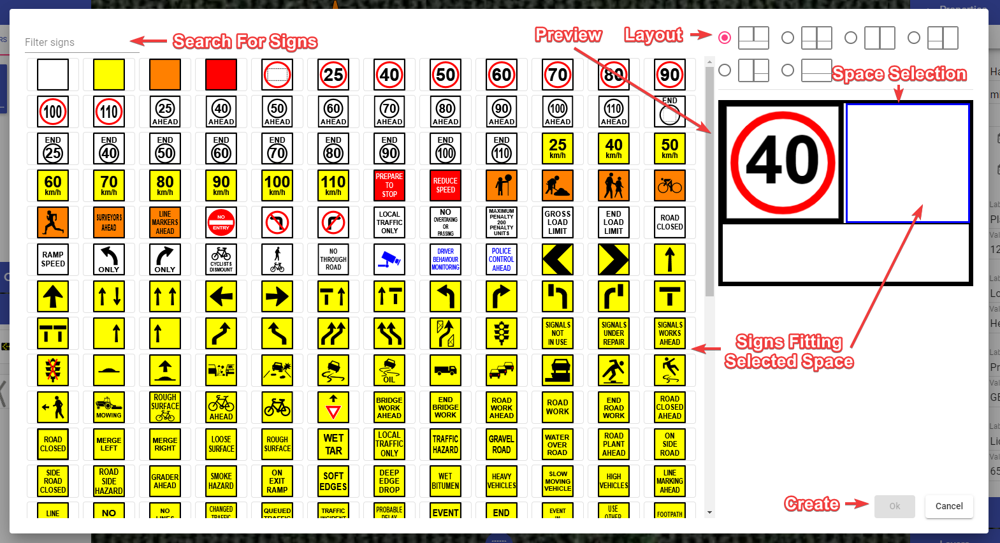

---

sidebar_position: 7

---
# Multi-Message Marker (Australian version only)

When this tool is selected, the **Multi-Message Sign Creator** window appears (shown below). Here you can add the panels of the sign and make all the necessary adjustments. You will have many different signs to choose from and can select up to three signs for the message board.

## Using the Multi Message Sign Creator

- Select the **Multi Message Sign** tool from the Devices tab in the Tools palette. New dialogue will appear.
- Choose the right layout for your multi-message sign in the top-right corner of the dialogue.
- Choose a the space you want to fill out by clicking on it in preview. A signs with proper size will appear on the left.
- Browse through the available signs or use the filter input to search for the desired one.
- Click on the sign to populate the selected space in the Multi Message Sign frame. Space selection will automatically move to the next space.
- When multi-message sign is finished click **OK** and drop the created sign on your canvas area.

### Quick tips

- Once created, save the multi-message sign to your [Scratchpad](/rapid-online/rapidplan-online-workspace/scratchpad-palette.md) for later use.
- You can edit already created multi-message signs. To do this, click on **Edit MMS** button inside sign's Properties.

### Listing the Multi-Message Sign in the Manifest

To list multi-message sign in the manifest select the multi-message sign you want to appear in the manifest and check the **Show in manifest** checkbox in its Properties. You have different options for displaying multi-message sign in the manifest:

- **Default** - The multi-message sign occupies a single position (row) in the manifest, listing all the signs in the entry name.
  
- **Panels** - Each sign that builds multi-message sign occupies a different position in the manifest.
  
- **Panels & Frame** - Same as above. But, additionally to the signs, the manifest will also list the multi-message frame.

Choose desirable option in multi-message sign's properties, this setting is called "Manifest entries".
