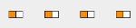

---

sidebar_position: 1

---
# Delineators

Traditionally, one of the most difficult things to do when creating a traffic plan was run out lines of bollards, cones, barrels, etc. The RapidPlan Online delineator tool allows you to drag out lines of devices in seconds.

**Types of delineators available:**

There are thirteen standard types of delineators available:

|         Name         |              Delineator              |
| :------------------: | :----------------------------------: |
|        Barrel        |   |
|       Barrier        |   |
|       Bollard        |   |
|         Cone         |   |
|        Jersey        |   |
|     Para webbing     |   |
|   Pedestrian tape    |   |
|    Safety barrier    |   |
|       Tubular        |   |
|   Type 1 Barricade   |  |
|   Type 2 Barricade   |  |
| Vertical faced panel |  |
| Water filled barrier |  |
