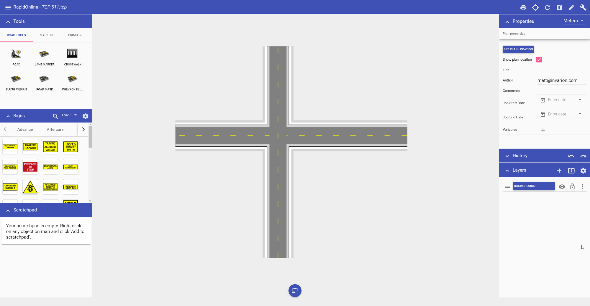
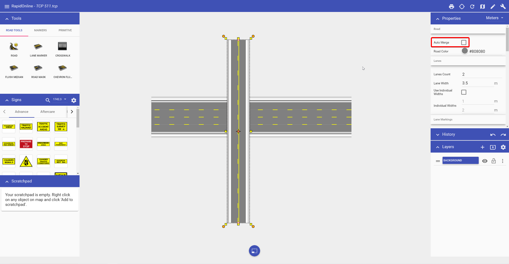

---

sidebar_position: 5

---
# Creating intersections

The real power of RapidPlan Online lies in its ability to quickly create intersections. They are formed by "adding" new roads to existing ones. RapidPlan Online will automatically remove edge lines, shoulders, and sidewalks to blend at the intersecting point where a road is overlapping another road.

**To form an intersection:**

- Select the Road tool from the Tools palette;

- Draw your first road;

- Now draw a second road overlapping the first road.

**To cover up lane markings:**

- Select the tool from the Road tools in the Tools palette;
- Start using the tool as you would use the Work zone tool drawing a perimeter of the road mask enclosing all the lane markers you want;
- Right click to finish.

**To create an overpass:**

- Select the road you want as the overpass;
- In the Properties of the selected road, uncheck **Auto merge**;
- Style the overpass road as required.

