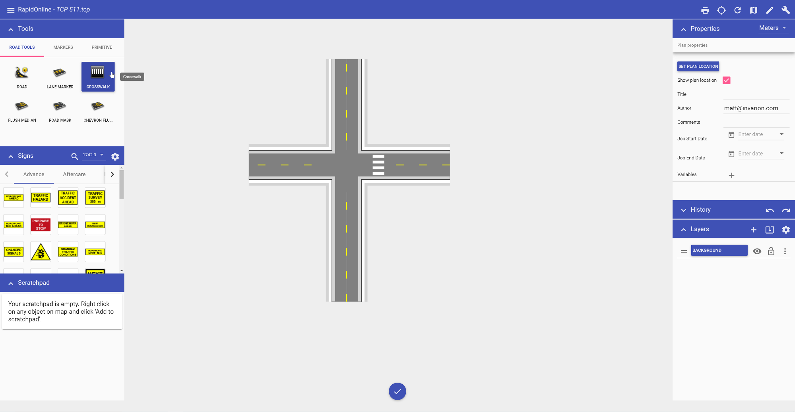

---

sidebar_position: 6

---
# Creating a Crosswalk

The Crosswalk tool is a handy tool that creates crosswalks on any road that you draw. There are a few options available when editing the crosswalk. You can change the crosswalk width and type to parallel or hatched. The stripe width and spacing can also be changed to accommodate your specifications. All of this can be changed in the crosswalk Properties.

**To create a crosswalk:**

- Draw your road;
- Select the **Crosswalk** tool from the Road tab in the Tools palette;
- Place your cursor where you want the crosswalk to start and left click your mouse once to start drawing;
- Right click to finish drawing.

