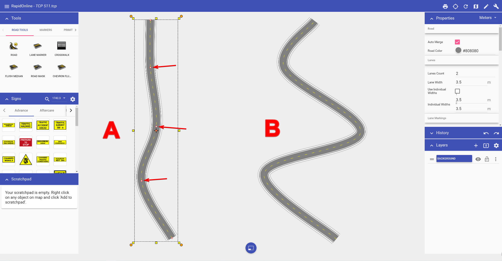

---

sidebar_position: 2

---
# Editing the Road

Like any other object in RapidPlan Online, the shape of the road can be edited by shifting it's control points. Also akin to other objects in RapidPlan Online - its Properties can be changed as well.

## To edit the roads shape

- Select the road by clicking on it. This will make it's control points visible.
- Drag any of the control points until you have the desired shape of the road.

In the image below, **Road A** is the original road. **Road B** has had the 1st, 2nd and 3rd control points moved to change the shape of the road.

## Road Properties

Road objects are fully customizable. Elements that can be adjusted include:

- Road color, geometry and auto merge
- Lane number, width, color and lane markings
- Left side/right side edge line, shoulder and sidewalk widths and colors
- Legend and manifest preferences

All of these properties can be adjusted by clicking the objects, then navigating to the Properties Palette (pictured below), and making alterations

