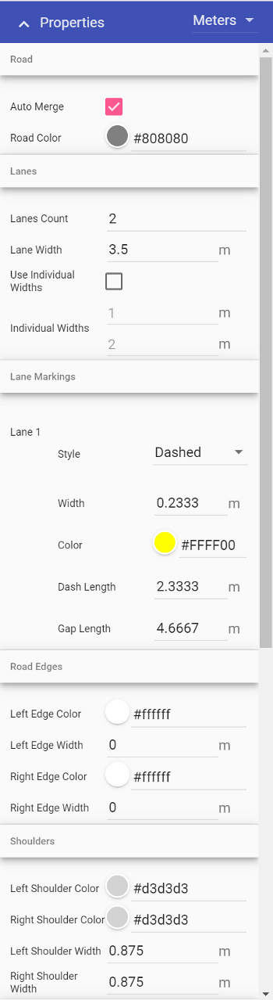

---

sidebar_position: 4

---
# Road Properties

Road objects are fully customizable. Elements that can be adjusted include:

- Road color, geometry and auto merge
- Lane number, width, color and lane markings
- Left side/right side edge line, shoulder and sidewalk widths and colors
- Legend and manifest preferences

All of these properties can be adjusted by clicking the objects, then navigating to the Properties palette, as shown in below.

