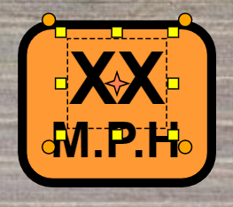

---

sidebar_position: 2

---
# Editing and Creating Custom Signs

All signs are made up of basic objects (text, shapes, etc). Not only does this make it easy to adjust the speed on a sign, for instance, it also makes each sign object completely customizable.

To edit a  sign, simply select it on your Canvas Area, then select **Ungroup** in the [Context Menu](/rapid-online/rapidplan-online-basics/control-points.md). This will separate the sign into it's basic objects.

**Note**: Some signs with multiple objects may require more than one un-group.

Once you have ungrouped the objects, you will be able to edit, move and change the individual properties of each object within the sign.

For example, in the image above, the first text object is selected. In its properties you can then change the value to a specific amount.

To regroup the sign objects, simply select all of the objects by using a (click and drag) selection window. Then, right click and select **Group** in the Context Menu. You have now edited and created a new sign.

**Quick tip:** Add the new sign to your [Scratchpad](/rapid-online/rapidplan-online-workspace/scratchpad-palette.md) for later use, by selecting **Add to scratchpad** in the Context Menu.

## Creating custom signs

You can create a custom sign from primitive objects and/or parts of other signs (each sign can be ungrouped into basic shapes). When you finish preparing your sign, click the right mouse button on your object/objects and choose the "Convert to sign" option from the context menu. In the dialogue that will show up fill up the sign code and the sign description fields, and press "save". Your object/objects will be converted to a sign.
This will allow for easy integration with the manifest and the legend, as your custom sign will have proper sign properties ("show in manifest", "show in legend", etc.). The sign you created will not appear in the signs library, but you can save it to the scratchpad for later use.

