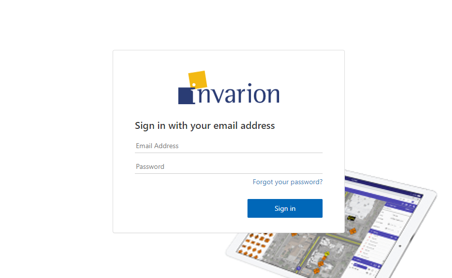
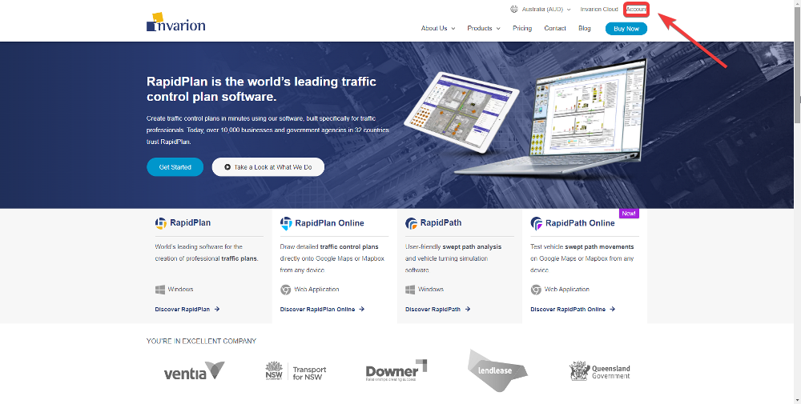

# Getting Started

### Logging into Invarion Cloud

To start using **RapidPath Online**, first log into your **Invarion Cloud** account. **[Log in here](https://cloud.invarion.com)** using the credentials you created when signing up for a subscription.

### Creating your first plan

To create your first plan click on **Create** button and choose **New swept path plan** from the menu. You will be automatically taken to the **RapidPath Online** interface.

After you finish, you can find your plan in the **Plans** sections inside **Invarion Cloud**.

### My Account

If you ever need to update your subscription, **[Log in here](https://invarion.com/)** and navigate to the **My Account** page.

