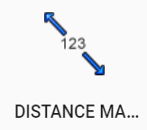
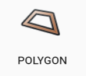
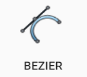
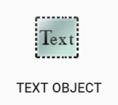
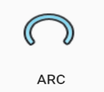
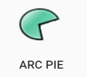

---

sidebar_position: 9

---
# Tools Palette

The Tools palette contains most of the elements required to draw a plan. The tools are separated into two categories, detailed in the tables below:

## Marker tools

|                      Label                       |                Button                 |                         Description                          |
| :----------------------------------------------: | :-----------------------------------: | :----------------------------------------------------------: |
|                  **Title box**                   |   |                   Details plan information                   |
|                 **Manifest box**                 |   |           Itemizes the number of objects on a plan           |
|                  **Legend box**                  |   |         Defines features and symbols used on a plan          |
|                 **Arrow marker**                 |   |                    Draws an arrow object                     |
|                 **Angle marker**                 |   |              Marks the angle between two points              |
|             **North arrow bearing**              |   |       Place a north bearing marker on the canvas area        |
|               **Distance marker**                |  |             Mark the distance between two points             |
|           **Combined distance marker**           |  |       Mark multiple distances separated into segments        |
|            **Offset distance marker**            |  |  Mark the distance between two points and offset the marker  |

## Primitive tools

|         Label         |               Button                |                         Description                          |
| :-------------------: | :---------------------------------: | :----------------------------------------------------------: |
|     **Polyline**      |   | Draws straight lines that can be connected in a series of segments |
|      **Polygon**      |   | Draws a polygon shape that can be filled with a custom color |
|      **Spline**       |   |               Creates a curved line along path               |
|   **Filled Spline**   |   | Creates a curved line that can be connected and filled with a custom color |
|      **Bezier**       |   | Create a curved line with greater precision using control points and curve handles |
|   **Filled Bezier**   |   | Create a curved line with greater precision using control points and curve handles. Fill with custom colors |
|    **Text object**    |   | Creates an object out of text that can be manipulated like any other object |
|     **Text box**      |   |          Creates a box that can be filled with text          |
|     **Rectangle**     |   |     Draw rectangular shapes and fill with custom colors      |
|      **Ellipse**      |  |      Draw elliptical shapes and fill with custom colors      |
|        **Arc**        |  |              Draw a line in the shape of an arc              |
|      **Arc Pie**      |  | Creates an arc shape that can be filled with a custom color  |
| **Rounded Rectangle** |  | Creates rectangle with rounded edges that can be filled with a custom color |
|   **Insert Image**    |  | Insert an image file (jpeg, png, gif) to drop onto the canvas area |
