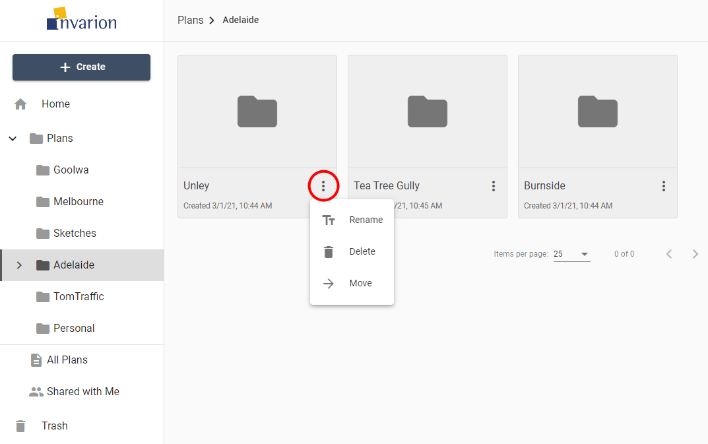

---

sidebar_position: 5

---
# Folders

Folders help you keep your files organized and separate inside your Invarion storage. They work the same way as they work on your computer.

## Creating new folders

To create a folder click on ****+ Create**** a button and choose the **New folder ** option. A window will appear with input for the new folder's name. Enter the desired name for the folder and click **Ok**. **New folder** will appear in your current location, and you will be taken straight into it.

**Notes:**

- You can change folder's name at any time using rename option in the folder's context menu on folder's details.
- You can't create a folder inside Home, All Plans or Shared with Me section.

## Folders actions

You can see available actions for the folder by clicking on the ****three dots**** button near its name. This will open folder's context menu with all options listed.

Different actions you can take in folders:

|Action|Description|
|---|---|
|**Rename**|Change name of the folder.|
|**Delete**|Move folder and its contents to trash.|
|**Move**|Move folder and its contents to a different location.|
