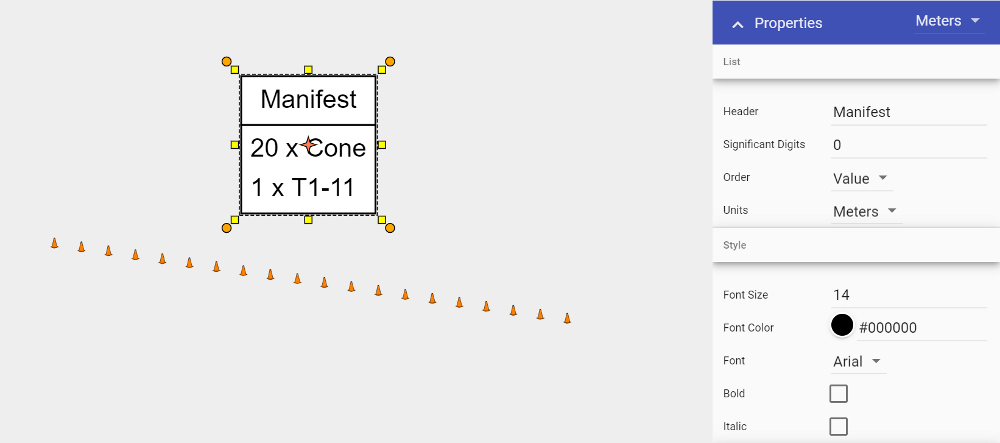

---

sidebar_position: 1

---
# Legend and Manifest Tools

The Legend and Manifest tools are used as object references for your plan.

The **Legend** is a visual representation of any objects you have displayed. It is often used to assist the reader's comprehension of the plan.

The **Manifest** will give you a running total of objects placed on your plan. This assists those with an active role in bringing the plan to life, or those who need a more detailed idea of what the plan involves.

## Adding a Legend

- Select the **Legend** Tool from the Markers tab in the Tools Palette;
- Place this in the desired location on your plan;
- Select an item on your plan that you want to appear in the Legend by clicking on it once;
- Under the **Legend & Manifest** tab in the Properties palette make sure the **Show in Legend** section is set to **True**;
- Do this for any other items on your plan you wish to appear in the legend.

**Note:** If you change **Entry Name** of a sign or object from Auto to Custom, you can edit the sign or object's displayed description in the Legend.

## Adding a Manifest

The Manifest works the same as the Legend when adding, you can also determine what appears in the manifest by selecting an object and then adjusting its properties.

You can order your manifest by Value or Name, by toggling the selection under the Order subheading.

