# Preparing Swept Path Analysis

## Adding Vehicle to the Plan

The first step in creating the Swept Path Analysis is adding a vehicle to your plan. To do this, open the Vehicle Library by selecting the Vehicle tool from the Tools Palette. In the Vehicle Library window, choose the standard and vehicle you are interested in and click the "Add" button at the bottom of the window. Now place the vehicle onto your plan with the left mouse button.

If you want to use different vehicle's parameters you can change them in Vehicle Library before clicking the "Add" button. These changes will not be saved into the Library, they will only apply to the vehicle that will be added to the plan.

Vehicles in RapidPath can be positioned and rotated just like any other object. But, their size is automatically adjusted to the plan's scale and cannot be changed. You can also copy/cut and paste vehicles.

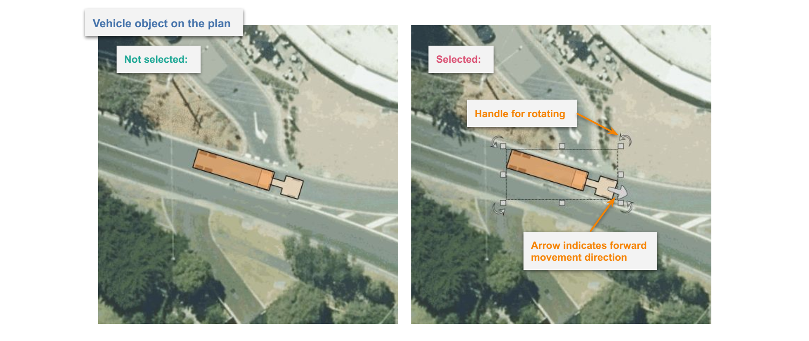

When clicking on a vehicle you can check its most important parameters inside the Object Properties window.

## Editing an Existing Vehicle

To edit the existing vehicle double click on it with the left mouse button. The Edit Vehicle window will appear. Here you can change all the parameters and save them to the vehicle object on your plan. You can also use the same window to replace the current vehicle with another one.

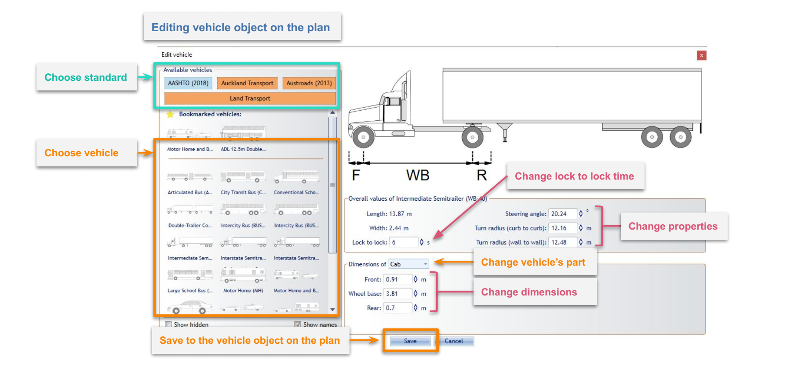

If you want to only edit the "Lock to Lock" parameter you can select the vehicle and do it inside an Object Properties window. Object Properties can also be used to style the vehicle which is very useful when using multiple vehicles with similar shapes on the same plan.

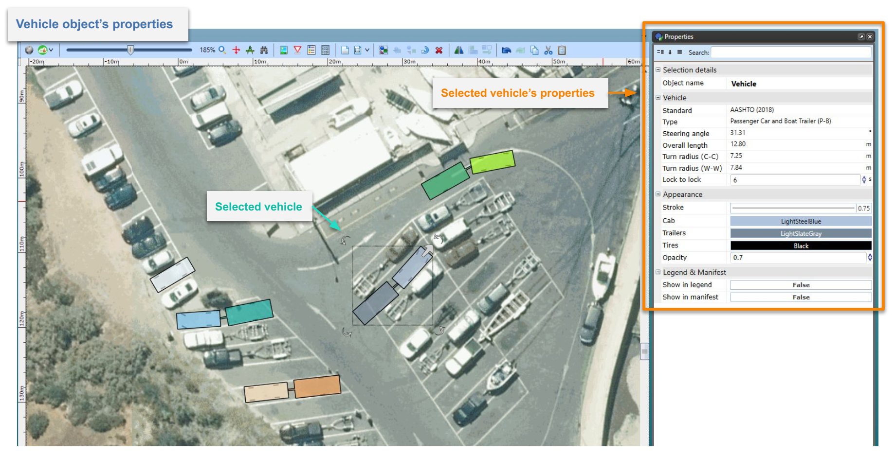

## Drawing a Vehicle Path

To start drawing a Vehicle Path select the vehicle on your plan and click on the arrow in front of it. Arrow indicates the forward movement direction of the vehicle. You can also click on the vehicle with the right mouse button and choose "Vehicle" sub-menu and "Draw Path" option.

When in "Draw Path" mode a special window called "Section details" will appear with settings for:

- **Speed** - Vehicle speed.
- **Friction** - Lateral friction factor dependent on the vehicle speed and calculated according to the chosen standard. To set a custom value disable speed and friction dependency by clicking on the link/unlink toggle button on the left and enter the desired value in the field.
- **Turn on Stop** - Turning this option on ("True") allows the vehicle to make a stop and turn the front wheels between different sections (at control points) of the Vehicle Path.

and info such as:

- **Min radius** - Minimum turning radius (centerline) of the vehicle at the given speed and friction.
- **Max angle** - Maximum turn angle of the vehicle at the given speed and friction.
- **Max speed** - Maximum speed for the vehicle taking into account standard guidelines, given speed, friction and current turn radius.

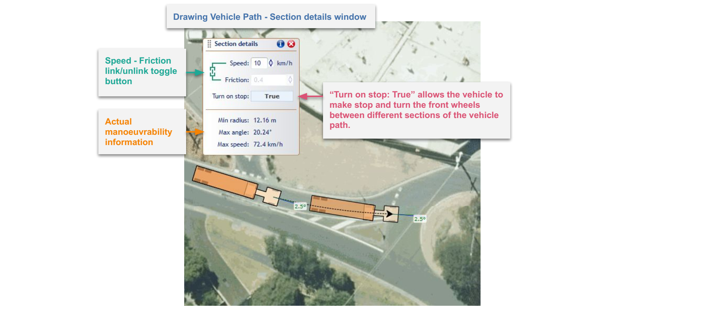

After setting the speed, friction and "Turn on Stop" option you can start drawing the path. To do this, indicate the points on the canvas area by clicking the left mouse button. These points are called "Control Points" and can be adjusted later. Each point creates another section of the Vehicle Path.
Each section can have different parameters such as speed, friction and turn on stop setting.
You can adjust section parameters before making each point to create a path that consists of sections with different speeds, friction and other parameters. Alternatively, the section parameters can be adjusted after drawing the path.

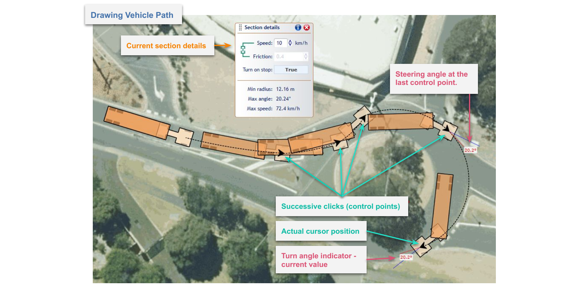

You can only create a path within the maneuverability capabilities of the current vehicle at given parameters such as speed, friction, lock to lock time, etc. Observing a real-time preview of the vehicle and turn angle indicator during drawing will help you make the desired path. The turn angle indicator will turn red when the maximum turn angle is reached.

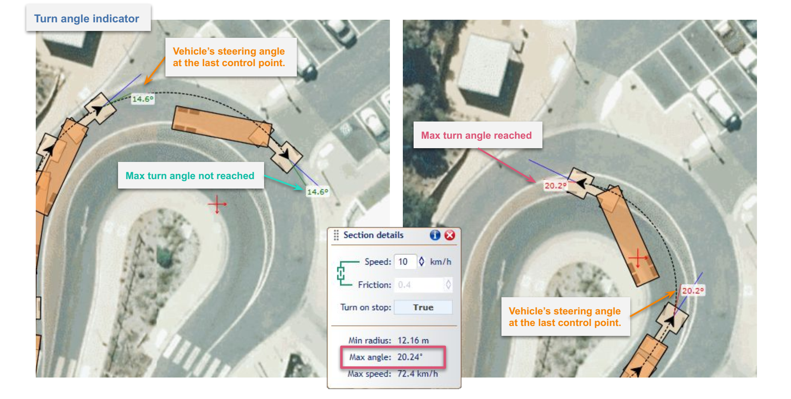

Use Undo ("Ctrl+z") and Redo ("Ctrl+y") options while creating Vehicle Path to avoid wrongly placed or unwanted points. Additionally, you can edit your path later, when it is finished. Finish drawing the path by clicking with the right mouse button or pressing the "Esc" key.
Once the Vehicle Path is finished it turns into a separate object that can be freely moved and rotated. You can delete the Vehicle Path without deleting the vehicle.

## Evaluating a Path

In order to obtain Sweep Envelope (the result of the analysis), the Vehicle Path needs to be evaluated. To evaluate a path, select it with the right mouse button, choose "Vehicle Path" sub-menu and then "Evaluate" option. You can also use the "Evaluate" button inside the Vehicle Path's properties in the Object Properties window. To do so, search for "Swept path" group and "Show" property.

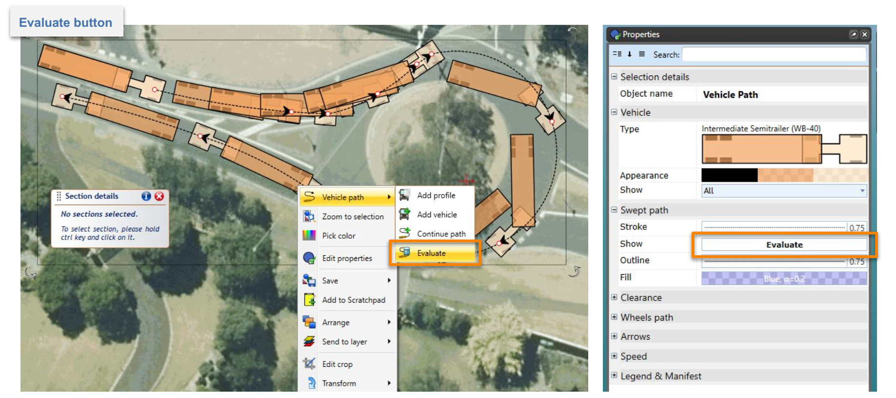

Note that the evaluation process can take a while for particularly long paths. You can track the green progress bar that goes along the path during the calculation.

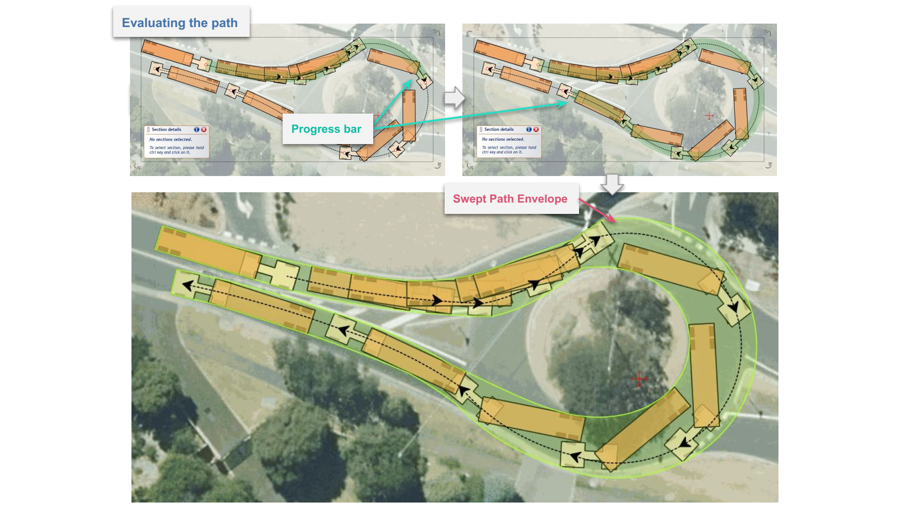

Making changes to the already evaluated path will cause the existing Sweep Envelope (now obsolete) to disappear, requiring the path to be re-evaluated. Sweep Envelopes are not saved to the plan's file but are visible in the print and export upon evaluation. You can evaluate all the Vehicle Paths in the active diagram by clicking the right mouse button anywhere on the canvas area and choosing the "Evaluate Paths" option.

Sweep Envelope can be styled using Vehicle Path's properties in the Object Properties window.

## Clearance Envelope

Clearance Envelope will allow you to add offset to the Sweep Envelope to accommodate for driver error or real world situations. It can only be displayed on the evaluated Vehicle Path. To turn on Clearance Envelope go to the "Clearance" section in path's properties and change "Show" property to "Filled" or "Outline". You can edit the clearance envelope offset distances in the "Clearance" section of the path's properties.
Making changes to the clearance offset will require re-evaluation of the path.

## Styling Vehicle Path, Sweep Envelope and Clearance

Vehicle Path, Sweep Envelope and Clearance can be styled in many different ways using Vehicle Path's properties in the Object Properties window. Aside from visual customization, you can also:

- Add wheel paths separately for front and rear wheels;
- Add speed information to path sections;
- Show/hide directional arrows that indicate the start of each path section; and
- Show/hide vehicles along the path.

## Editing a Vehicle Path

After the Vehicle Path is finished you can edit and adjust it using these methods:

1. **Editing the parameters of the path's sections** - You can edit each section's parameters such as Speed, Friction and Turn on Stop. To select a section, first select the path, then click on the section you want to change with the left mouse button while holding "Ctrl" key. Once the section is selected, it will highlight red and a "Section details" window will appear. You can also select multiple sections by clicking on them one by one while holding "Ctrl" key.

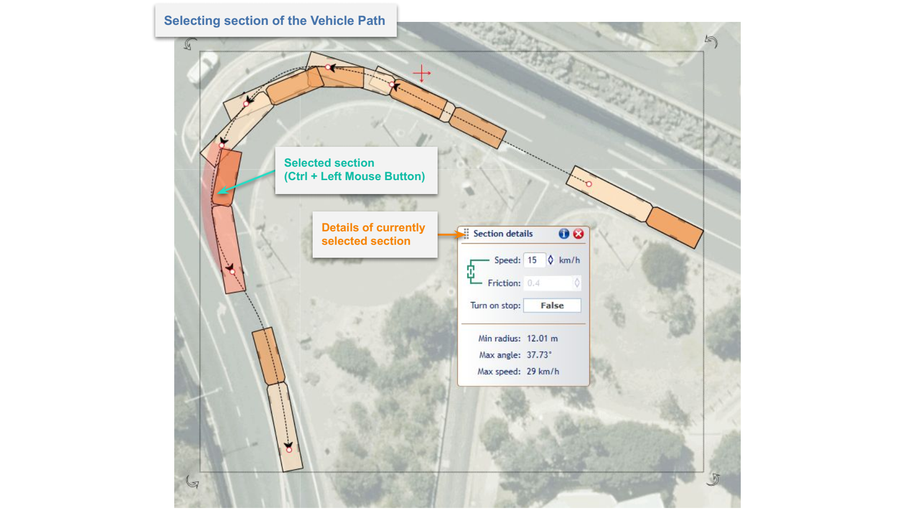

1. **Editing control points** - You can change Vehicle Path's geometry by moving control points. Select the path, then click on one of the red circles and drag while holding the left mouse button. It is possible that you won't be able to move it freely because its position can be bounded by vehicle's manoeuvrability capabilities (sections' properties, other control points).
You can also remove the control point by clicking on it with the right mouse button and choosing "Remove control point" option from the context menu.

1. **Continuing the path** - You can continue drawing already finished path. To do this simply click with the right mouse button on the path you want to expand, then choose the "Continue path" option from the "Vehicle path" sub-menu. Continuing the path works the same way as drawing the path.

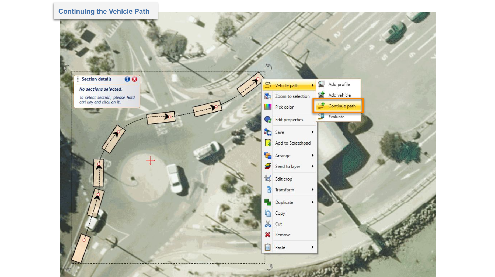

## Adding Additional Vehicles to the Path

You can add additional vehicle objects to the path to:

- Better visualize results of your analysis;
- Check position/behavior of the vehicle and trailers at a specific point along the path; and
- Start a new analysis from a selected point on the existing path to make multiple connected analyses or different route variants.
  
To add additional vehicles to the path, click on it with the right mouse button and choose the "Add vehicle" option from the "Vehicle path" sub-menu. Now place the vehicles along the path by clicking with the left mouse button. When finished press the right mouse button or "Esc" key. These are ordinary vehicle objects that can be moved, edited and even replaced with other vehicles. You can also start a new swept path analysis from them.

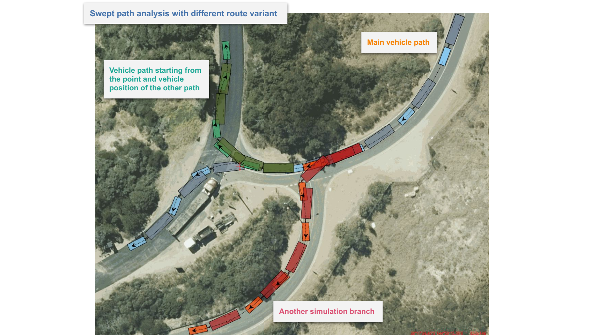

## Adding Vehicle Profile to the Plan

It is always a good idea to add the description of the vehicle used for the Swept Path Analysis to your document. You can easily do this by clicking with the right mouse button on the vehicle or Vehicle Path and choosing "Add profile" from the appropriate sub-menu ("Vehicle" or "Vehicle path").

The Vehicle Profile displays the:

- Vehicle's name;
- Vehicle's side view with the most important dimensions; and
- Vehicle's properties crucial for the Swept Path Analysis.

You can ungroup the vehicle profile, then edit and style its parts - just like you would any other RapidPlan objects.

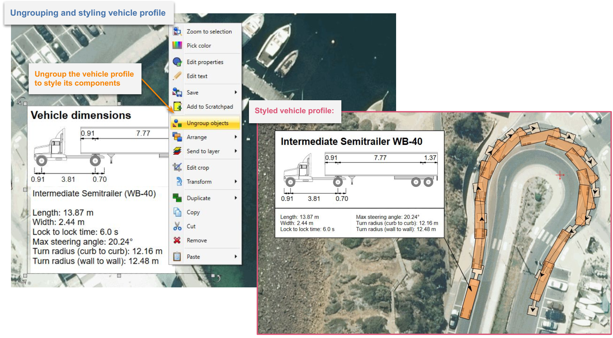
