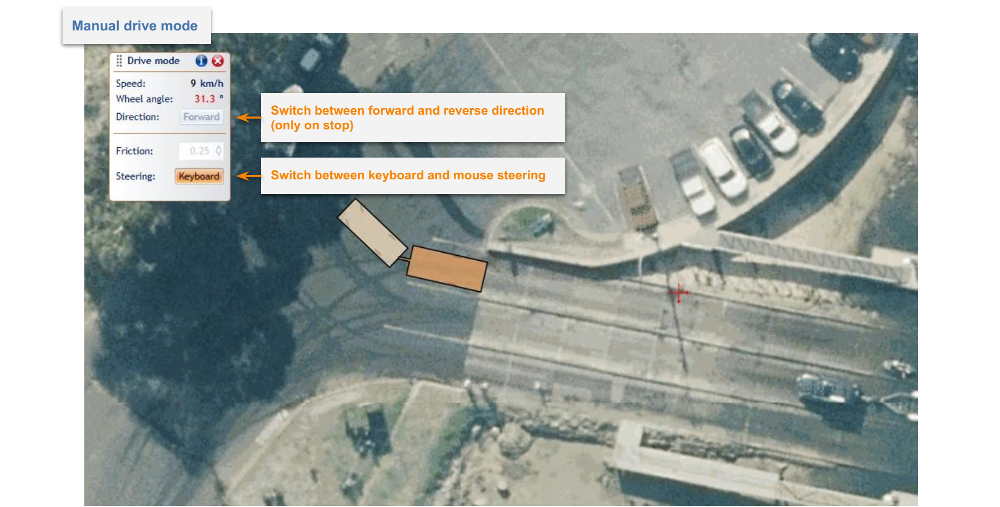

# 6. Manual Drive

Manual Drive mode allows you to drive the vehicle manually around the canvas area. You can drive in forward and reverse and check how the vehicle behaves at different speeds. 

This tool was originally developed to test RapidPath's algorithms. Please let us know if you find it useful and you would like it to be further developed.

## 6.1 Using Manual Drive

To manually drive a vehicle you first need to add a [vehicle](Definitions) to the canvas area. For this, please follow the directions in [Chapter 5.1 Adding Vehicle to the Plan](Preparing-Swept-Path-Analysis#51-adding-vehicle-to-the-plan). When you have a [vehicle](Definitions) on the canvas area, click on it with the right mouse button and choose the "Drive" option from the "Vehicle" sub-menu. A dialog box will appear. Choose the direction in which you want to drive, lateral friction factor and steering method (Mouse or Keyboard). You can now click on the canvas and start driving the vehicle. Press "Esc" key if you want to quit Manual Drive mode. Controls for different steering modes are presented below.

<!-- _Figure 6.1 Manual Drive mode_ -->

|Mouse Controls||
|---|---|
|Left Mouse Button | Increase vehicle's speed by holding the left mouse button. |
|Right Mouse Button | Decrease vehicle's speed by holding the right mouse button on the canvas area. |
|Double-Click with Left Mouse Button | Stop the vehicle|
|Move cursor around the canvas| Turning the wheels|
|R| Switch between forward and reverse direction. Can be switched only when stopped. |

|Keyboard Controls||
|---|---|
|Left Arrow| Turn the wheels to the left, hold for tighter turn|
|Right Arrow| Turn the wheels to the right|
|Up Arrow| Accelerate |
|Down Arrow| Lower the speed |
|R| Switch between forward and reverse direction. Can be switched only when stopped. |

While in driving mode, please pay attention to the "Speed" and "Wheel angle" information displayed in the "Drive mode" window. There may be a situation in which you won't be able to increase the speed any further because of your current wheel angle, and vice versa.
