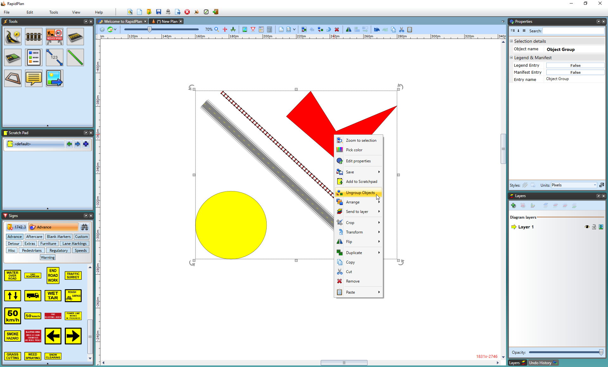

---

sidebar_position: 9

---
# Grouping Objects

One of the most important techniques to master is grouping. By grouping objects together, you can manipulate them as one item. Grouping is also necessary if you wish to create and save your own signs. You can group any of the RapidPath elements together and the technique is the same, regardless of which elements you choose to group.

## To Create a Group

There are two ways to group objects

 1.Using the Grouping Toolbar:

- **Select All** - selects all of the objects on your plan
- **Group** - groups your selected objects together
- **Ungroup** - ungroups the grouped objects

    

    **Note**: The individual bounding boxes and move handles are replaced by just one for the entire group.

2.Using your mouse or keyboard:

- Select the objects you want to group together (by pressing **SHIFT** and selecting each desired object individually or by dragging your mouse encompassing all of the desired objects).
- Right click and select **Group objects** from context menu
- Or hold **CTRL + G**.

## To Ungroup a Group

- Select the necessary group.
- Either right click on the group and select **Ungroup Objects**, use the Ungroup icon in the toolbar or use the shortcut key **CTRL + U**.

**Note:** Grouped objects can edited without ungrouping. Double click on the group item to launch the quick edit box - you will then have the option to change the properties of a particular object in the group.

## Signs are like groups

Every sign in RapidPath is made of a group of primitive objects - the most simple of which consist purely of a colored rectangle or square with text. These can be edited using the techniques shown above to create new signs.

*See [Chapter 12]#chapter-12-creating-your-own-signs for more information on modifying and creating your own signs.*
