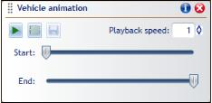

---

sidebar_position: 7

---
# Animating Vehicle Movement

Once a vehicle's path has been designed as discussed [here](./preparing-swept-path-analysis.md), the vehicle's movement through that route can be recorded to be shared as a .gif file.

Among other use cases, vehicle path animation can be a valuable means of demonstrating expected routing to a trainee driver, as an easily understood method to communicate a layout concept, or as a way to add color to a presentation.

## Recording a vehicle's path

Before recording, if desired, remember to [import aerial imaging](/rapid-path/integrated-mapping/accessing-integrated-mapping.md), so that it will appear in the exported animation.

To begin recording, **right click** on the swept path, click **Vehicle Path**, and click **Animate Movement**.

The **Vehicle Animation** interface will appear as pictured below. You'll then set up the recording's parameters before exporting.

### Managing recording parameters

To start, press the **Play** button the top left of the **Vehicle Animation** interface, in order to get a feel for any changes that need to be made. Changes made in the interface will apply to preview animation as well as export.

**Setting Playback Speed:** If playback speed needs to be altered, enter a different value in the playback speed field. This is a multiple value, so if '1' is replaced with '1.5', playback will be 1.5 times faster.

**Altering Start and End points:** By default, the recording will start and end at the point the swept path was initiated and ended at. If this isn't preferable it can be altered using the **Start** and **End** slide bars.

### Setting the Recording Region

Like our plan exports use **print regions**, our animation exports use **Recording Regions**.

To set a recording region, click the file icon, located between the **Play** and **Save** icons in the **Vehicle Animation** interface.

Then, like drawing a rectangle, click the two far corners of where you would like the recording region to be located on the canvas.
Once placed the corners can be relocated using control points, and if preferred you can click the **Set Recording Region** icon again to replace the region you have drawn.

## Exporting the vehicle animation

Once playback speed, start and end points, and a preferable recording region have been set, you are ready to export.

To proceed, simply click the **Save** icon, choose a file location and name, and click save.
