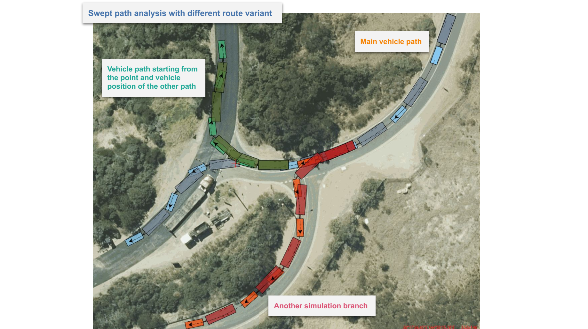

---

sidebar_position: 5

---
# Swept Path Analysis Properties

A Swept Path's properties can be updated in order to:

- Convey information about direction of travel, speed, wheel tracking.
- To allow for a margin of error.
- To distinguish one path from another on your plan.
- To create a unique, trademark style for your company.

Details on the different properties of a swept path can be found below, organised by the headings of each sub-section.

## Vehicle section

Below the object name heading, the first editable section of a swept path's properties is **Vehicle**.

Here you will see details and a **preview** image of the appearance of the vehicle as it will appear on plan if desired.

**Appearance** below this can be clicked for a drop down menu to appear, consisting of editable options to alter the outline and fill of the vehicle's parts, and opacity settings for each part of the vehicle.

A lower opacity value will make that part of the vehicle more opaque. Opacity of a part of the truck can also be applied by selecting the opaque option in the color selection menus.

**Show** below dictates whether the vehicle is visible in the swept path, and if so - at which stages:

- **None** - The vehicle will not be shown in the path.
- **Start** - The vehicle is only visible at the start of the path.
- **End** - The vehicle is only visible at the end of the path.
- **Both** - The vehicle is visible at the start and end of the path.
- **All** - The vehicle is visible at every control point placed in the swept path.

**Note** that the initial vehicle placed on plan (from which the swept path was initiated) is a separate object to the swept path. If you would like this vehicle to not be visible in your plan, it will need to be removed by selecting and omitting it on the canvas.

## Swept Path section

Alterations to the core elements of a swept path:

**Stroke** opens a drop down menu in which the appearance of a line that follows the path of the centre-point between the front axles of the vehicle through the swept path. Changes can be made to the line's width, color, style (e.g. dotted line or solid), and the shape of the ends of the line/dots.

**Show** will alter the appearance of the swept path, or whether it will appear at all:

- **Filled** - the outline and fill color of the path will appear.
- **Outline** - only the outline of the swept path is visible.
- **None** - the outline and fill of the path is not visible.

If **none** is selected, your swept path might, if the settings are selected, consist of an image of the vehicle at each point in the swept path, the **stroke line**, **clearances** which will be discussed next, **wheel paths**, **directional arrows** and/or the **speed** the vehicle is traveling at.

Predictably, **Outline** controls the appearance of the outline of the swept path, and **Fill** controls the appearance of its outline.

## Clearance section

The initial envelope of the swept path displays the path of the vehicle if a driver navigates the space without error or any unexpected factors. To allow for variables, a **clearance** envelope around the original swept path envelope can be added.

As for other variables, the **Show** drop down menu can set the the **clearance** area to:

- **Filled** - Show the clearance fill and outline.
- **Outline** - Online show the clearance envelope's outline.
- **None** - Do not include the clearance envelope.

The **outline** and **fill** can be altered with dropdown options.

The amount of **clearance** allowed for can be altered in every direction, by altering the distance in the **front**, **rear**, **left** and **right** fields.

## Wheel Path section

The path of a vehicle's wheels through a space can be a valuable element to display, particularly in spaces where curbs are being navigated - over which the outer body of the vehicle can hang without consequence.

**Show** can be set to:

- **None** - wheel paths are not shown.
- **Front** - front wheel paths are shown.
- **Rear** - rear wheel paths are shown.
- **Both** - both wheel paths are shown.

Below **Show**, alterations to the lines demonstration the **front** and **rear** wheels can be made.

## Directional Arrows section

Directional arrows are a valid aesthetic choice if preferred, and can be valuable in a situation where a vehicle could possible be reversing, or in which the vehicle is performing both forward and reversing movement in the same path.

**Show** options:

- **Regular** - display the arrows in solid fill at every control point in the swept path.
- **Stop** - displays the arrows in solid color every time the vehicle stops, and an outline of the arrow at every control point where the vehicle doesn't stop (keeping in mind if [turn on stop](./preparing-swept-path-analysis.md/#editing-an-existing-vehicle) is engaged for a control point, this will make the arrow solid).
- **None** - arrows are not visible.

**Stroke**'s sub-settings **Width** alters the width of the outline of the arrows, and **color** controls the color of the arrow.

**Size** alters the size of the arrows in a swept path.

## Speed section

The speed of a vehicle can be altered in each segment of a swept path, doing so will alter its capacity to corner, and can be important contextual information for the reader of the plan.

**Show** can set **speed** information to:

- **None** - the speed of the vehicle isn't displayed.
- **Text** - the speed of the vehicle is displayed in text without a background.
- **Background** - the speed of the vehicle is displayed in text with a background.

