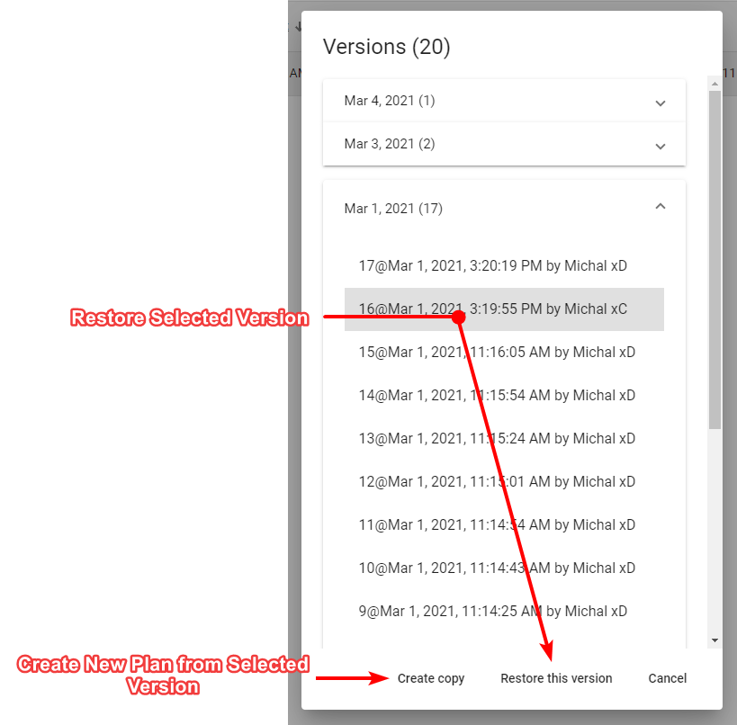

---

sidebar_position: 9

---
# Plan's History and Recovery

Invarion Cloud keeps track of every modification made to the plan. Anytime the plan autosaves a new recovery point is made. Thanks to this you can easily go back to any previous version of the plan undoing some unwanted changes made by yourself or other collaborators. It is like turning back the clock.

Version History may also come in handy when something unexpected happens to your plan. You can then retrieve the last correctly working version of the plan.

To use recovery options select **History** from the plan's context menu. A new dialogue will appear listing all the possible recovery points for this plan. Select the one you are interested in and choose one of two options, **Restore this version** or **Create copy**. The former restores the original plan to the selected previous version. The latter creates a new plan from information saved in the selected recovery point. Recovery points listed in the **History** dialogue are divided by date.
In addition to that each one has unique number, timestamp and user responsible for the modification made to the plan.

**Note:** If you restore a previous version of the plan, you will still have access to the later versions of the document. So, no risk is involved.

**Tip:** Plan's history may also come in handy when something unexpected happens to your plan. You can then retrieve last correctly working version of the plan.

---
Invarion Cloud keeps track of every modification made to the plan. Anytime the plan autosaves a new recovery point is made. Thanks to this you can easily go back to any previous version of the plan, undoing some unwanted changes made by yourself or other collaborators. It is like turning back the clock.

**To use recovery options with the plan open:** Select Open History from the Main Menu, or click the Autosave Icon at the top of the screen, and then click View History in the pop up menu.

Alternatively, you can **open the Plan History menu from the Invarion Cloud**, by clicking the 3 dots button next to a plan and then clicking History.

## Using the Plan History dialog

Once the Plan History dialog menu is open, you can view **Saved Versions** or **Local Backups** of your plan:

- **Saved Versions** are saved into the cloud.
- **Local Backups** are created in the event that there’s a disruption in your connection.

Recovery points listed in the Version dialogue are listed by date. Each one also has a unique number, timestamp and user responsible for the modification made to the plan.
Select the saved version from either of these menus, and when ready choose one of two options:

- **Restore This Version:** Restores the original plan to the selected previous version.
- **Create Copy:** Creates a new plan from information saved in the selected recovery point.

If you restore a previous version of the plan, you will still have access to the later versions of the document. So, no risk is involved.

### Note on Local Backups

Upon reopening your plan, if RapidPlan Online notices that there is a Local Backup with further edits than the most recently saved version in Invarion Cloud, you will be asked if you would like to restore the plan from your local backups. You can click on the status icon to view saved versions of your plan and restore a previous version.
