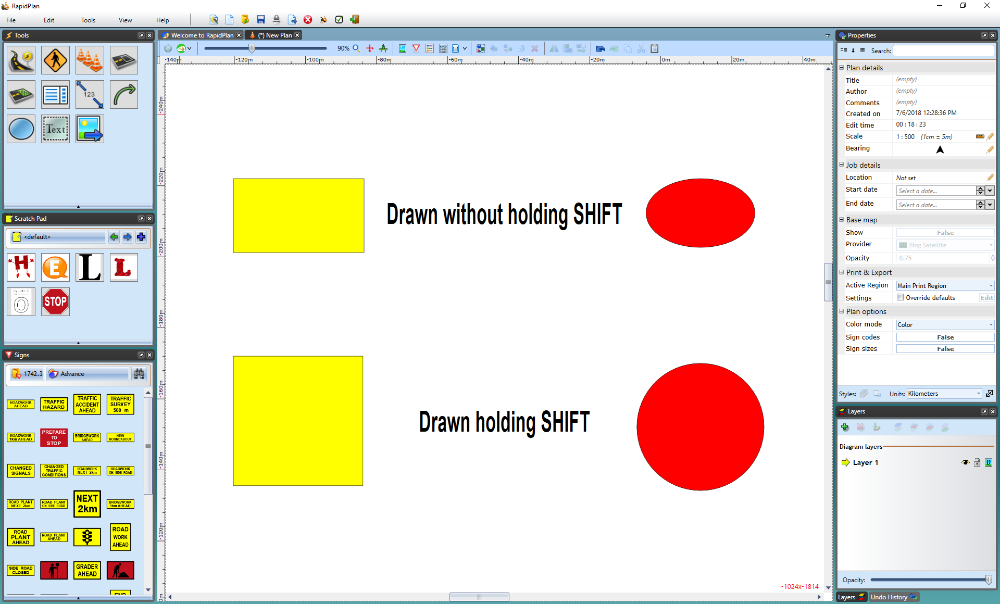

---

sidebar_position: 4

---
# Auto Aligning Lines and Shapes

To ease the creation of these items, there is a very useful auto align feature which allows you to keep the dimensions of your lines and shapes square.

In most cases, holding **SHIFT** while you draw will cause the control points you are placing to align themselves to a 90º or 45º increment. This means that you can keep your verticals and horizontals perfectly straight.

Rectangles, Rounded Rectangles and Ellipses form special cases - holding **SHIFT** still keeps their second control point at 90º or 45º but this of course has the effect of holding the rectangles to perfect squares and the ellipse to a perfect circle.

