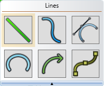
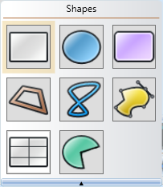
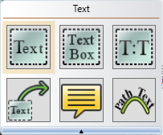
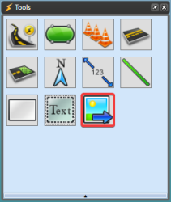

## The Tools

There are 20 different basic tools you can use. The majority are classed as either lines, or shapes. The Text and Image tools operate differently to all the others.

To see broken down listings of each class of tool, please visit [The Tools Palette](/docs/rapid-plan/3.%20The%20RapidPlan%20Screen/3.2.2.2%20The%20Tools%20Palette.md) page.

|The **Lines tools**|The **Shapes tools **|The **Text tools **  |The **Image import tool **|
|----------------------------------|------------------------------------|----------------------------------|----------------------------------------|
|          |           |           |                |

**Note:** The Arrow, Text Arrow and Callbox are all covered in the marker tools sections ([part 1](/docs/rapid-plan/9.%20The%20Marker%20Tools/9.15.4%20The%20Six%20Distance%20Markers%20(pt1).md) and [part 2](/docs/rapid-plan/9.%20The%20Marker%20Tools/9.15.4%20The%20Six%20Distance%20Markers%20(pt2).md)).

