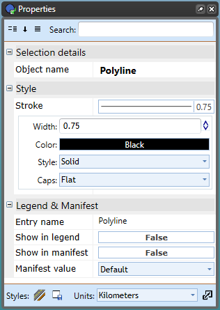

## The Lines Properties

The properties of the **Lines** are defined by setting the style of stroke used:

|Properties      |                                                                      |
|----------------|----------------------------------------------------------------------|
|**Stroke width**|The weight of the line (default is 0.75).                             |
|**Stroke color**|The color of the line.                                                |
|**Stroke style**|A variety of dashed, solid and dotted line styles are available.      |
|**Stroke caps** |Choose from four line end styles: flat, square, round, and triangle.  |
:::

