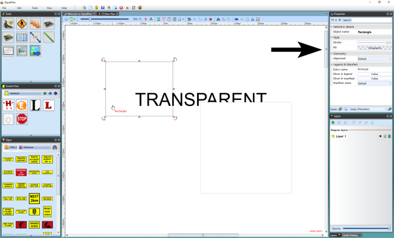

## The "Transparent" Color 

One of the color settings for lines, shapes and text is **transparent**. In the case of lines including shape outlines this effectively just means **none**. For the fill of shapes however, a transparent setting allows you to see what's underneath. Don't confuse **transparent** with **white**. As the diagram below shows, they are very different.

