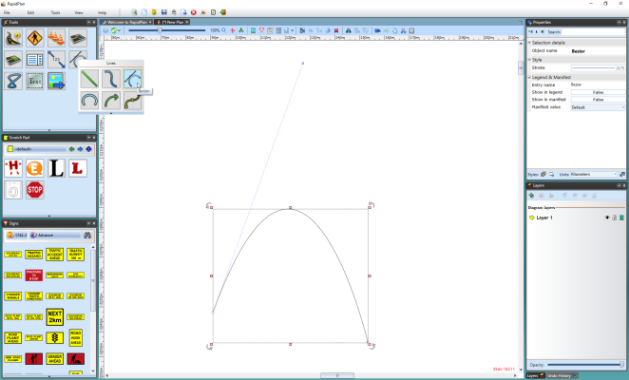

## The Bezier Tools

One of the trickier techniques to master in RapidPlan is the drawing of a Bezier. Beziers offer a powerful way to create curves with great precision. 

There are two components of a Bezier curve:

 - The center **Control Point** sets the apex of the curve.
 - The **Curve Handle** allow you to set the direction and sweep of the curve.

    

