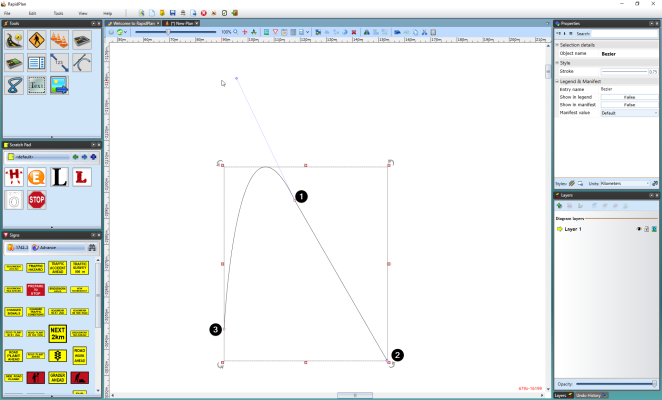

## Drawing a Bezier 

When you are using either the **Filled Bezier** or the **Bezier** tool, it is important to understand that, depending on the technique you use, there are two different types of control points you can lay down.

A regular **Control Point** (without the Bezier functionality) is placed if you simply click, release the mouse button then move on.

A Bezier style control point (with **Curve Handles**) is placed if click, hold, drag, and unclick as you drop out a
point.

The tools are designed this way so that you can create a shape or line that has both curved and straight corners, such as the one below:

