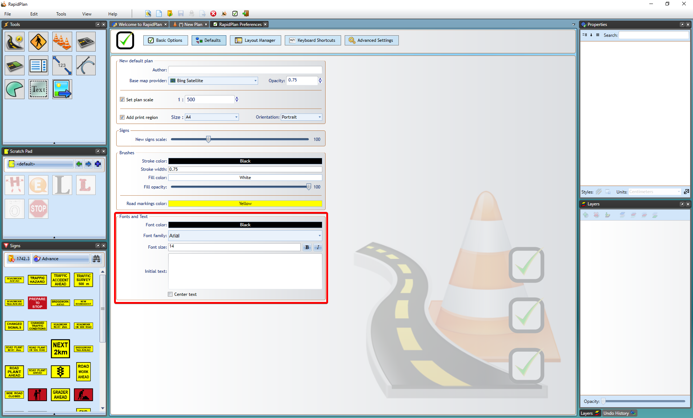

## To set a new Default Font through the Preferences Screen

 - From the main menu Select **Tools** > **Preferences**.
 - Select the **Defaults** tab (see below).
 - Scroll down to the Fonts and Text section.
 - Set the font as you require or set any other parameters you desire.
 - Exit Preferences by closing its tab.

    

