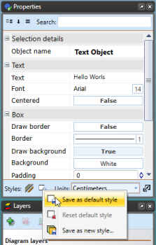

## To set a new Default Font through the Properties Palette

 - Select the **Text Object** tool from the Text tab.
 - Click on the canvas and enter you text in the allocated area.
 - Use the Properties Palette to set the font as you require or set any other parameters you desire.
 - Click **Save as Default Style** at the base of the palette when complete.

    

