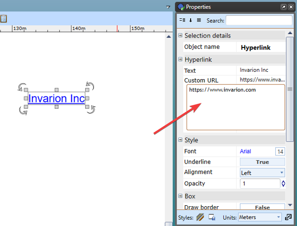

---

sidebar_position: 18

---
# Hyperlink tool

The Hyperlink text tool can be used on your plans to reference online resources and other files via clickable links on exported PDF documents.

To activate the tool, select **Hyperlink** from the Text tab.

Click on the canvas area to type in the text you wish to have as your clickable link. In the **Custom URL** area, you can enter the link for the website or document you wish to hyperlink.

When the plan is exported to PDF, the reader will be directed to the web page or document when the hyperlink is clicked.

