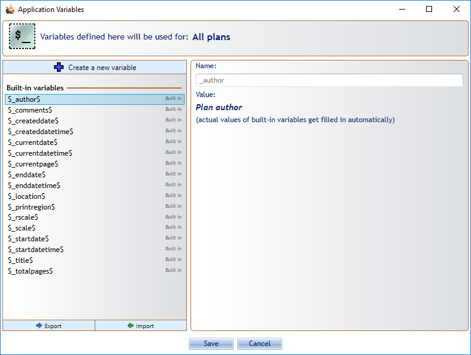
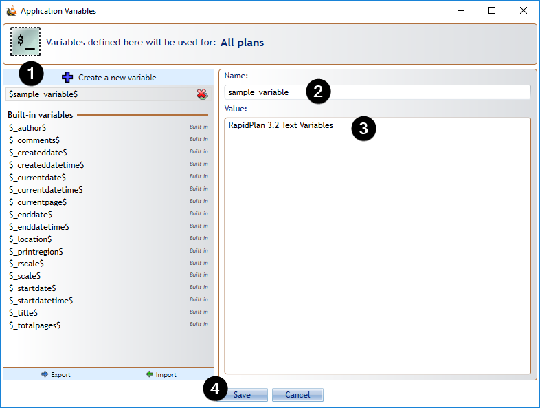
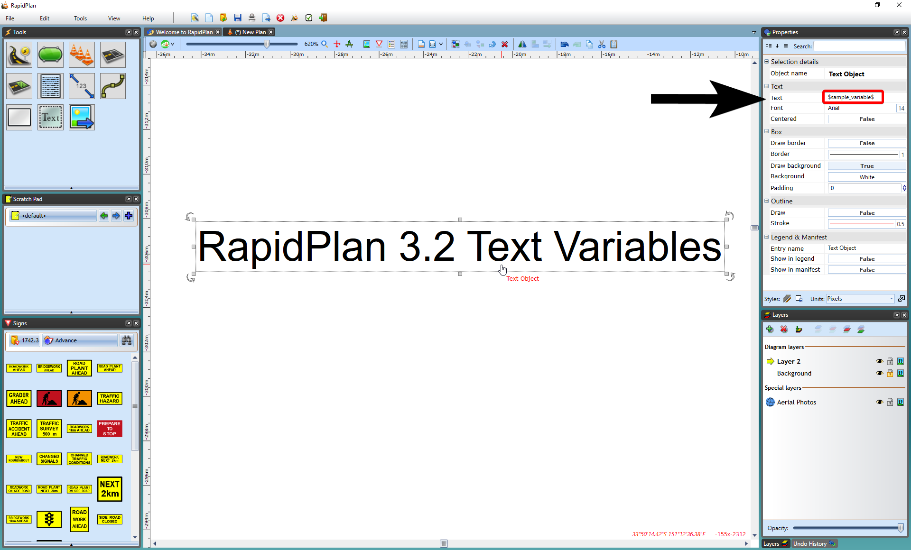
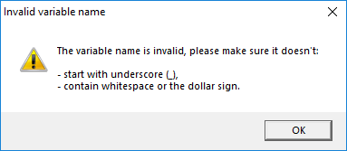
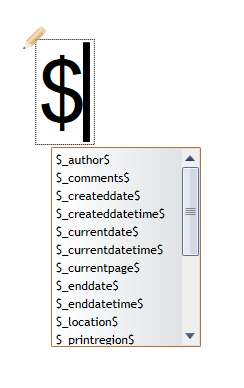

---

sidebar_position: 17

---
# Text variables 

New feature in RapidPlan is **Text Variables** tool. The Text Variables can be used to create reusable templates and objects where text can be auto-filled based on **built-in** or **custom variable** values. Custom variables can be defined for a single plan only, or application-wide. To open the list of variables go to **Tools** > **Text Variables**. 

To create a new custom variable, open the **Text Variables** tool, click on **+ Create a new variable** button at the top. Name your custom variable, enter the value, then press the **Save** button.

Custom variables cannot start with **' _ '** (*underscore*) or contain **'$'** (*dollar sign*) or whitespace

When editing text, type the **'$'** character to see the list of available variables. Select the variable. Click off the object and the variables will be replaced with values taken directly from the diagram (Author, Date, Plan title, etc.). Note that the text is still editable and can be changed at any time. Text variables can be particularly useful when you want to copy a object containing text across to another plan. The object will not need to be edited, as the variables will adjust the text to reflect the values of the new plan. This makes the variables an excellent tool for creating generic templates or print frames that dynamically adjust to specific plan values.

**Note:** Text variables can be used on **any** object containing text (signs, etc.).

