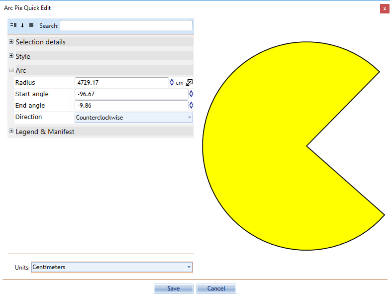

---

sidebar_position: 10

---
# The Arc Tools

There are three arc-based tools in RapidPlan, the **Arc** tool, the **Pie Arc** tool and the **Road Arc** tool. All of these tools are created from a radius, making perfect curves.

**To use an arc tool:**

- Select the necessary arc tool from the Tools palette.
- Click once to set the radius of the arc.
- The second click is where you draw your arc by moving the cursor in the direction of the arc.
- Click to complete the object.
- Right click to drop the tool.

You can also specify numeric values for the radius, start angle and end angle for the arc.

