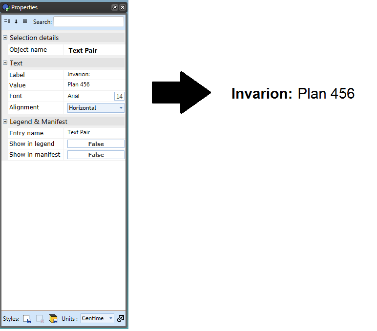

---

sidebar_position: 15

---
# The Text Pair Tool 

The Text Pair tool operates similar to the regular text tool but with limited editing capabilities. For instance, you cannot set a background color with the text pair tool nor can you set your fonts to bold. This tool only provides a Label and a Value to be set thereby giving it it's name as a text pair.

**To use the Text Pair tool:**

 - Select the **Text Pair** tool from the Text tab.
 - Click on your canvas to place the text box and enter your desired text for your Label. (In the example the **Label** is Invarion).
 - Enter your desired text for your Value. (Plan 456 is the **Value** in the example).
 - Use the Properties Palette to set the orientation of the text. (Horizontal or Vertical)

    

