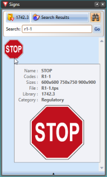

## Search Signs

New version of RapidPlan allows you to search entire signs library by a keyword, phrase, sign name or sign code. For example, if you were looking for a **STOP** sign, you can search it by name **stop** or by code **R1-1**.

**Note:** R1-1 is code for STOP sign in Australia, other countries codes may vary