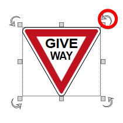

---

sidebar_position: 6

---
# Rotating Placed Signs

As is the case for most RapidPlan items, once a sign is placed on the canvas, there are three ways to rotate it.

Whilst free rotate is probably the easiest to do, it probably isn't ideal if you are aligning more than 1 sign. It
can be fiddly to get signs all pointing in precisely the same direction, so often you are better off using the
right-click Rotate option, or ****CTRL + R****.

**To rotate in set 90 degrees increments:**

 - Select the placed sign
 - Press ****CTRL + R**** repeatedly to rotate the sign 90 degrees clockwise

**To Rotate by set angle:**

 - Right click on the sign to reveal the context menu.
 - Click on **Transform** >  **90 degrees**, **180 degrees**, **270 degrees** or **Rotate by custom value**

    

**To free rotate:**

 - Select the sign that you wish to rotate. The rotation handles will become available for use. 
 - Using the rotation handle, drag the sign around until it is positioned as you require.

    
    
    **Note**: The rotation handles are the arrows placed at each corner of the sign, the arrow will turn red when the cursor is place over of it which means it is ready to use.
