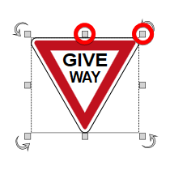

## Resizing Signs

Resizing signs in RapidPlan is no different to resizing any other object. Its achieved using the resize handles which appear when the sign is selected.

The sign is resized by simply dragging out the resize handles. However, there is one important factor that you should take into account when resizing your signs. If you want to keep the sign in proportion with itself while you resize, you must hold **SHIFT** as you resize it.

In the example below, we start with a regular sign, then resize it twice without holding shift. The final resized sign did make use of the shift key, ensuring it is kept in proportion.

