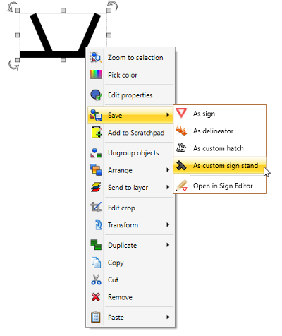

## Create a custom sign stand

To add a custom object to your sign stand list, simply create the object using any of the primitive/shape tools available in RapidPlan.

Once the created object is grouped together, you can Right click > Save > As custom sign stand

The new object will then be saved to your Symbol list for use as a sign stand.

