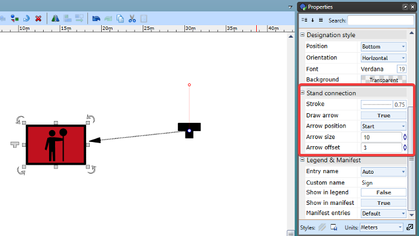

## Sign stand connector

All sign stand connections can display arrows for better identification on your plan.

To enable a sign stand connector arrow, click the sign, then you can adjust styling options in the 'Stand connection' subheading in the Properties palette.

You can enable the connector arrow to display on the sign end, stand end or both. 

