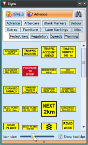

---

sidebar_position: 3

---
# Setting the Sign Icons Size in the Palette

You can change the size of the signs in the palette. This is helpful when using a screen at very high resolution, or just for users who are having difficulty with the small icons. By default the sign icon size on the palette is set to medium. 

**To change the signs icon size:**

 - Click on the bar at the base of the Signs palette to make options appear.
 - The size bar will pop up enabling you to select a different size (see below).

    