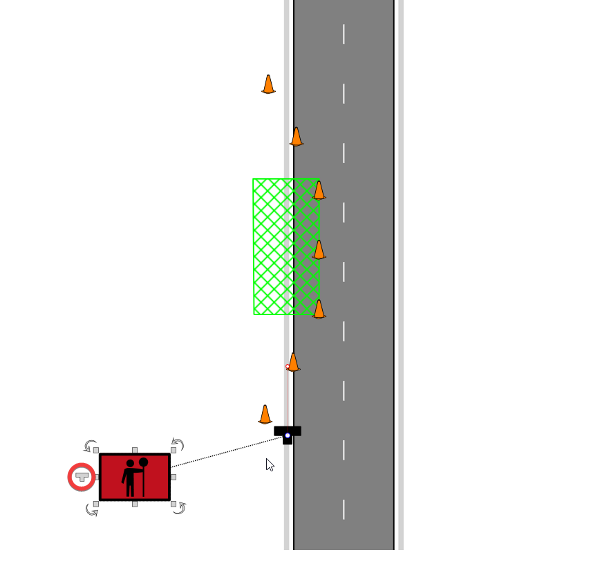
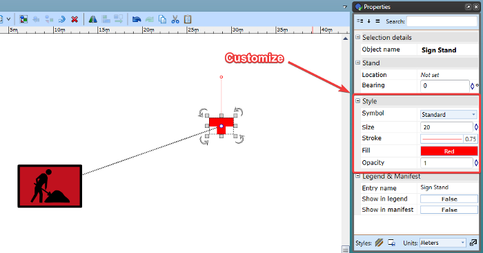
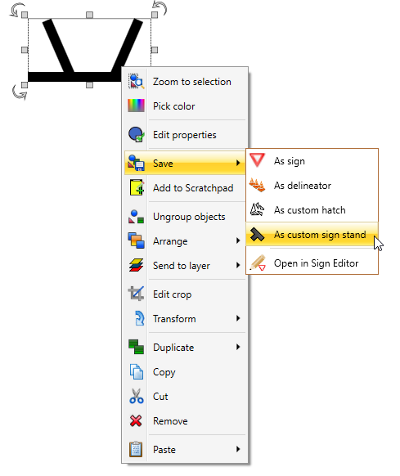
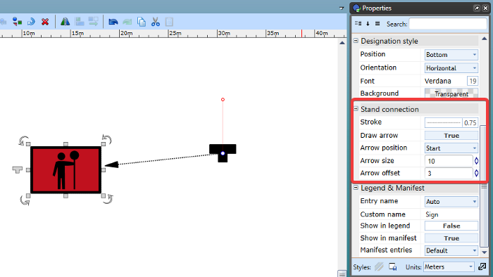

---

sidebar_position: 8

---
# Sign stands

All sign devices can display an adjustable stand icon to specify their exact position and orientation.

When a sign is selected, a Sign stand icon will display to the left of the sign, which functions as a control point for adding new stands linked to that sign. While the sign is selected, left-click and drag the stand icon to the desired position and release to drop in place.  To adjust the orientation of the sign stand, simply left-click and move the red control point extending off the front to the desired orientation.

To move the sign stand again, just select the stand then left click the blue control point and drag to the new position.

## Sign stand customization

Sign stands can be customized by adjusting style options in the Properties palette.

When the sign stand is selected you can customize its properties such as the color, size and symbol. 

You can also create your own custom object to use as a sign stand, as seen below.

### Create a custom sign stand

To add a custom object to your sign stand list, simply create the object using any of the primitive/shape tools available in RapidPlan.

Once the created object is grouped together, you can Right click > Save > As custom sign stand

The new object will then be saved to your Symbol list for use as a sign stand.

## Sign stand connector

All sign stand connections can display arrows for better identification on your plan.

To enable a sign stand connector arrow, click the sign, then you can adjust styling options in the 'Stand connection' subheading in the Properties palette.

You can enable the connector arrow to display on the sign end, stand end or both. 

