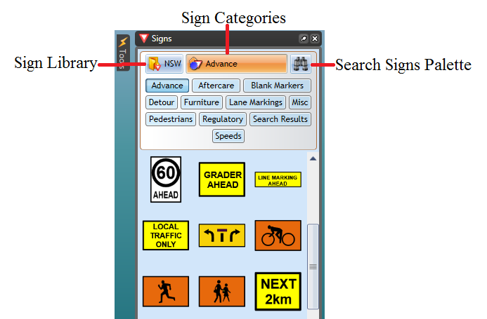
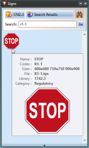

---

sidebar_position: 1

---
# The Signs Palette

The sign palette is the repository for each of the signs in RapidPlan. Aside from the signs themselves, the signs palette has three main components:

- The Sign Library
- The Sign Categories
- Search Signs

## Sign Library

This drop down control allows you to select which signage pack you wish to use. In some cases you will only have one pack installed, but certain countries will have numerous state/region packs also installed. Changing the sign pack often changes sign tab options.

## Sign Categories

The signs are organized into tabs so that they are easy to find. Clicking through the tabs will reveal the
signs for each category. You can view and example of the categories in the image below.

## Search Signs

New version of RapidPlan allows you to search entire signs library by a keyword, phrase, sign name or sign code. For example, if you were looking for a **STOP** sign, you can search it by name **stop** or by code **R1-1**.

**Note:** R1-1 is code for STOP sign in Australia, other countries codes may vary

## Setting the Sign Icons Size in the Palette

You can change the size of the signs in the palette. This is helpful when using a screen at very high resolution, or just for users who are having difficulty with the small icons. By default the sign icon size on the palette is set to medium.

**To change the signs icon size:**

- Click on the bar at the base of the Signs palette to make options appear.
- The size bar will pop up enabling you to select a different size (see below).

