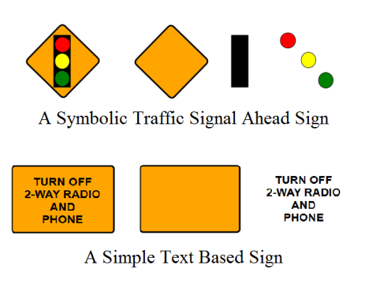

## What is a Sign Made of?

Before we launch into creating a sign, it's important to understand what the signs are actually made of. Every sign inside RapidPlan has been built up from basic items in the Tools palette (from the Shapes, Lines and Text tabs). Most sign faces are a **Rounded Rectangle**, the text is a **Text** object and irregular shapes are made out of filled **Polygons**, **Filled Beziers**, **Ellipses** and **Rectangles**. The items are then grouped and saved.

A couple of examples illustrate how the primitives are used:

If you aren't familiar with these base objects and how they work, see [The Basic Tools](/docs/rapid-plan/10.%20The%20Basic%20Tools/#chapter-10-the-basic-tools). It will be considered assumed knowledge for this chapter.