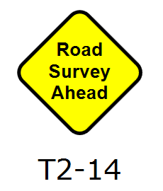

---

sidebar_position: 4

---
# Creating your Sign 
You should now have a good understanding of what is inside a RapidPlan sign file, so now we can go ahead and make one.

The basic steps for creating a sign are:

 - Create your base sign
 - Create the black and white version 
 - Save the base sign 
 - Create and save the variations

For the next section of the chapter, we will continue on in a tutorial style fashion to illustrate the steps. In order to better illustrate the process, we will be creating the fictitious sign shown below.

