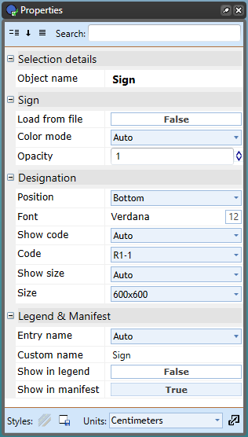

### Editing Signs from the Properties Palette

When a sign is selected, look within the properties palette to edit any information you want. Within the Properties palette you can:

 - Toggle color on or off to view black and white variation.
 - Toggle code on or off to view the sign code.
 - Toggle size on or off (This works only if a size was added within the Sign Editor Palette).
 - Change the Name Type in the Legend & Manifest section. Whatever you change the name type to will be how it is displayed within the manifest and/or legend. 
 - Toggle Manifest entry and Legend entry True or False.

    