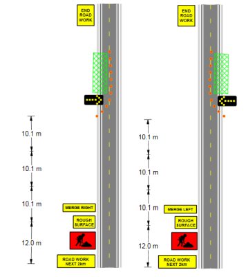
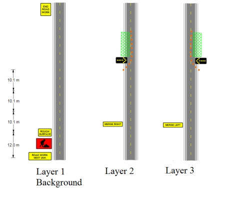

## Carefully plan which elements overlap Layers to avoid unnecessary reproduction

Sometimes, there will be elements that you wish to draw on multiple layers.

Take a look at this simple example below:

It is a simple, but very typical situation where there are works to be completed across two stages. In each case, four of the five signs are common (Road Work Next 2km, Symbolic Worker, Rough Surface and End Road Work) as are the distances between each of the elements on the plan.

The only objects that change on the plan are the **Merge Right** and **Merge Left** signs and the work site location, cones and arrow trailer.

Therefore, it would be wise to:

 - Create the road and common signs on the background
 - Place the left lane specific items on Layer 1
 - Place the right lane specific items on Layer 2

	

Notice in the image that there are no items that have been drawn more than once, meaning that the layout is optimized
