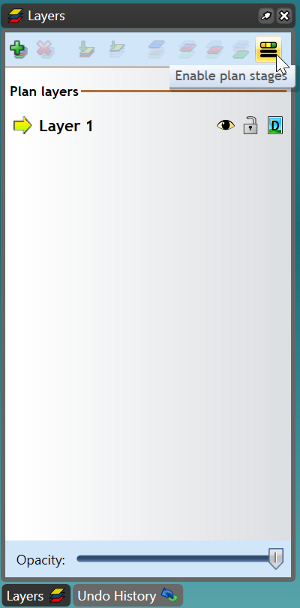

## Setting up plan stages

Selecting the **Enable plan stages** button will activate Plan stages on the layer you currently have selected.

When you have enabled the Plan stages on a particular layer, your layers tab will be separated into **Stage** layers and **Base** layers. 

The **Base** layers are where all of the permanent road objects, signs and markings will be displayed. The **Stage** layers are used for showing objects in different phases. For example, you can have one base layer with two stage layers - daytime setup and nighttime setup.

**Select stage** allows you change between your different stages. **Add/remove stage** allows you to create new stages with the click of a button. It also remove stages, if necessary. **Edit stage properties** allows you to name the stage and attach specific comments to it.