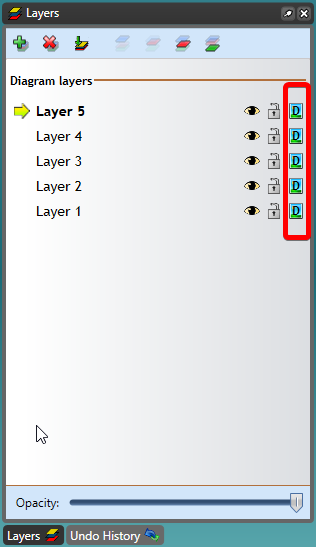

---

sidebar_position: 10

---
# Color Mode 

You can select each separate layer to be in color mode or fax mode by clicking the **Toggle Layer Color** Mode button.

**Note**: Layers can be copied, duplicated and objects within the layer can be rotated at an angle specified by the user. Layers can also be copied to another plan. These actions can be done by right clicking on the layer name and selecting from the list of options that appear. 

