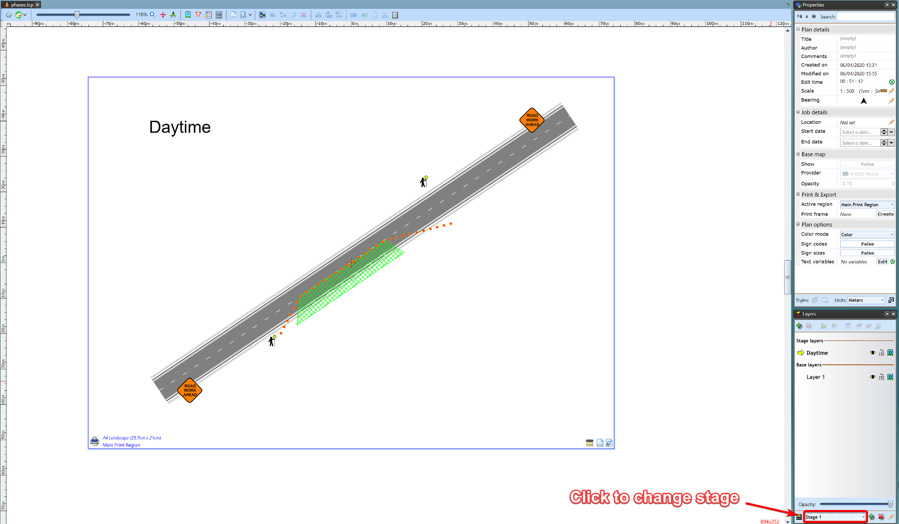

---

sidebar_position: 19

---
# Plan stages in action

Below is an example of how a plan stages setup might look.

Plan objects are set up on the base layer. These objects are always visible. Whilst daytime and nighttime stages contain different objects.

The following images show the two stages (daytime and nighttime)

