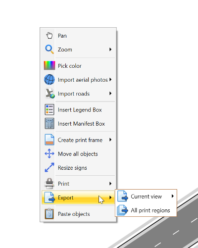
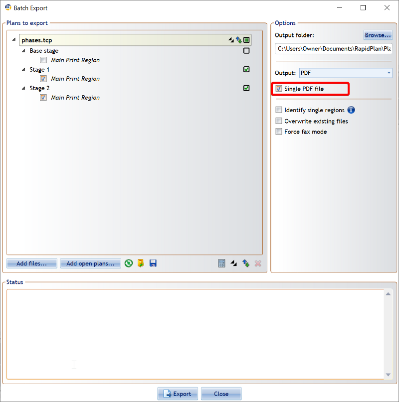

---

sidebar_position: 20

---
# Printing or exporting stages

Printing or exporting your plan stages is made a lot easier with the quick access right click menu. Simply right click to open the menu and then either select Print or Export all regions.

This will open up a dialogue box, with the plan stages automatically displaying in each layer based on how you arranged them. You can then select the checkbox to have all stages displaying in the one PDF file.

When ready, select **Export** and RapidPlan will save all of the plan stages into one PDF document.

