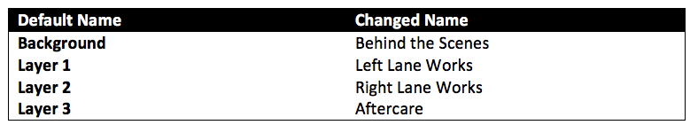

---

sidebar_position: 11

---
# Renaming Layers

Renaming layers is useful because it allows you to better organize your file around what part of the works your layer focuses on. For instance, you might rename layers as per the below table:

**To rename a layer in your plan:**

 - Double click on the desired layer from the Layer Selector (or Right click and select **Rename**). The name of the layer is automatically highlighted, ready for change.
 - Click inside the layer selector box and type in the new name for your layer.
 - Either press Enter or simply click back out onto the canvas. Your new name is saved.