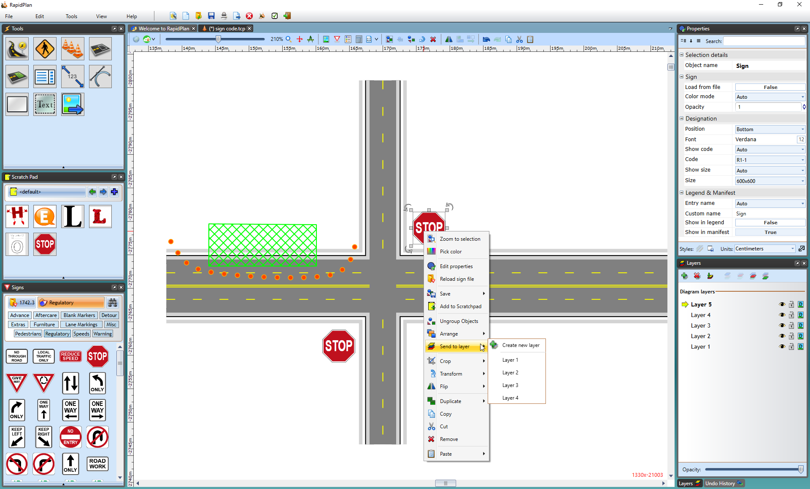

---

sidebar_position: 13

---
# The Send to Layer Function

The Send to Layer function allows you to move objects directly from one layer to another. You can elect to move one or more objects at a time. The advantage of this method is that it doesn't move the location of the moved items on the page, so it appears on its new layer, in the same place.

**To use the Send to Layer function:**

 - Select the object or objects that you wish to move.
 - Right click on the object (or one of the objects if there are more than one) and select **Send to Layer**. A list of available layers will appear.
 - Select the layer that you wish to send the object(s) to.

	
	
	**Note**: You can also select Create new layer to create a new one to send to.