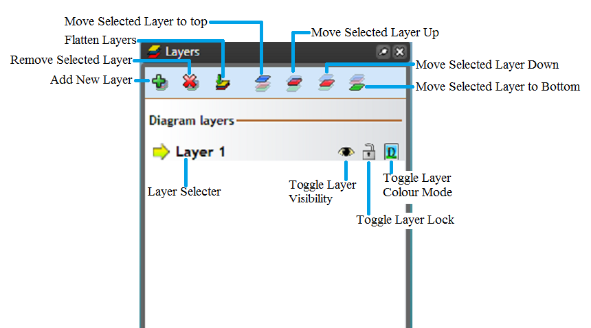

---

sidebar_position: 1

---
# Using Layers

*Many schemes are on just one road base...*

There will be a lot of cases where you will need to create more than one plan for a job, such as when you have multiple stages of works that need to be performed on different areas of the roadway. A good example of this is resurfacing; first, the traffic is diverted onto the right side of the road so that the left side can be asphalted, then the scheme is reversed.
Some road bodies will require plans for each stage, and that's why RapidPlan offers you multiple layers on your plan. Putting the road on the background and each traffic scheme on each subsequent layer means that you only need to draw your road once.

Imagine the **structure of the RapidPlan layers** as a set of overhead transparencies placed one on top of the other. The transparencies can be added and taken away at will (we do this in RapidPlan by changing their visibility status) meaning that at any one time you can choose to see either one or many layers at the same time.

By default, every plan starts with only one layer; the Background. Unlike all other layers that you add to your plan, the Background cant be removed.

## Accessing the Layer Tools

The layer tools are all housed on the Layers palette. From here you can select each of the layer functions and rename any layers that you need to. If the Layers palette is not visible just below the Properties palette, simply click on **View** > **Layers List** box from the main toolbar.

**Note**: Hovering over each icon will explain their functions

## Functions of the Layers

There are 7 general layer functions that you will use;

- Adding
- Removing
- Flattening
- Hiding/Showing
- Locking/Unlocking
- Moving Layers
- Copying
- Color Mode

### Adding Layers

Adding a layer is as simple as clicking the **Add Layer** button on the toolbar.

You will see a new layer name appear in the Layer selector box on the main toolbar. Anything you now draw will be placed on that new layer. You will also notice that you can no longer click on any of the items stored on other layers.

This layer characteristic is especially useful if your background is complicated and has many component pieces on it (such as lane markings/corners/etc.) and you need to drop traffic control elements over the top. It means that you wont inadvertently pick up road structures for instance, when you are trying to alter a placed cone or barricade line.

### Removing Layers

To delete a layer, simply ensure that you are on the layer that you wish to delete by checking in the Layer selector then click the **Delete Layer** button on the toolbar. Be careful though, because once a layer is deleted, it cant be undone.

**Note:** All objects on that layer will also be deleted.

### Flattening Layers

To merge all of your layers into one layer, simply select the **Flatten Layers** button. This will put all of the objects on your plan into one layer.

### Hiding/Showing Layers

One of the key benefits of multiple layered plans is the ability to show or hide different layers at different times. To show or hide a layer is very simple. Just select the layer that you want to hide or show from the Layer selector then click the **Toggle Layer Visibility** button on the toolbar (the blue eye).

### Locking/Unlocking Layers

Sometimes, when you are finished drawing a layer you might want to lock it, to ensure you don't accidentally change your completed work. To do this, simply select the layer you need, then hit the **Lock/unlock layer** button on the toolbar.

### Moving Layers

Within the Layers palette, you can move selected layers up or down for easier access or you have the option of clicking on Send to layer from the context menu which will be discussed later.

### Copying Layers

Right clicking on a layer will show options to **Copy** a layer, allowing you to right click > **Paste** the layer.
Alternatively, you may right click on a layer and **Duplicate** it to shorten the process.

You may also right click in unoccupied space in the **Layers Palette**, in order to **Copy Visible Layers**. Doing this will allow you to then **Paste** all visible layers, potentially duplicating many layers at once.

As a sidenote, you may also right click > **Rotate Objects** on a layer. Doing so will rotate the objects around the central point of the plan, marked by the red cross.

### Color Mode

You can select each separate layer to be in color mode or fax mode by clicking the **Toggle Layer Color** Mode button.

**Note**: Layers can be copied, duplicated and objects within the layer can be rotated at an angle specified by the user. Layers can also be copied to another plan. These actions can be done by right clicking on the layer name and selecting from the list of options that appear.

## Renaming Layers

Renaming layers is useful because it allows you to better organize your file around what part of the works your layer focuses on. For instance, you might rename layers as per the below table:

**To rename a layer in your plan:**

- Double click on the desired layer from the Layer Selector (or Right click and select **Rename**). The name of the layer is automatically highlighted, ready for change.
- Click inside the layer selector box and type in the new name for your layer.
- Either press Enter or simply click back out onto the canvas. Your new name is saved.
