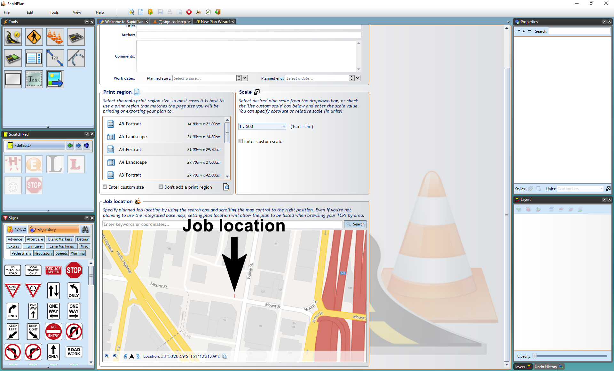
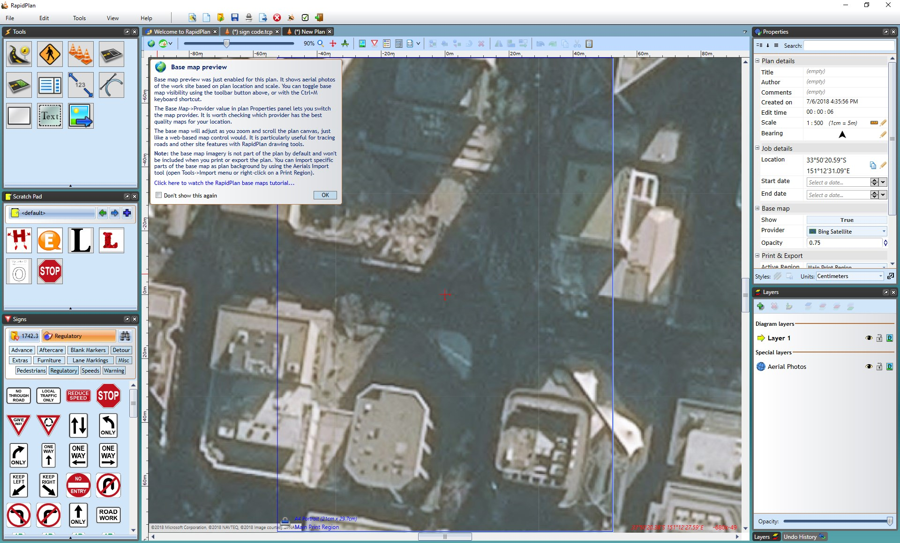

---

sidebar_position: 1

---
# Accessing Integrated Mapping

In [The Canvas](/docs/rapid-plan/The%20Canvas/) we covered how to start a new plan from different plan types, so in this section we will focus on aspects only relevant to integrated mapping.

**To access the integrated mapping feature:**

- Select the **New Plan Wizard** on the Welcome screen.
- In **step 1** select a **Base Map** plan.
- In **step 2** you can specify a plan scale or leave it as the default scale.
- Now specify a job location. You can search location by street address or longitudinal and latitudinal coordinates.
- The red cross in the center of the map points to the job location, scroll the map as necessary to the desired location.
- Once the scale and location are set, select **Create Plan** at the top.

    

    **Note:** As it is an unrestricted canvas, you can scroll and zoom to anywhere on the map you like. This means it can be important to be fairly precise when setting your job location in **step 2** so that you can find the exact spot when searching plans by location in the future.

    
