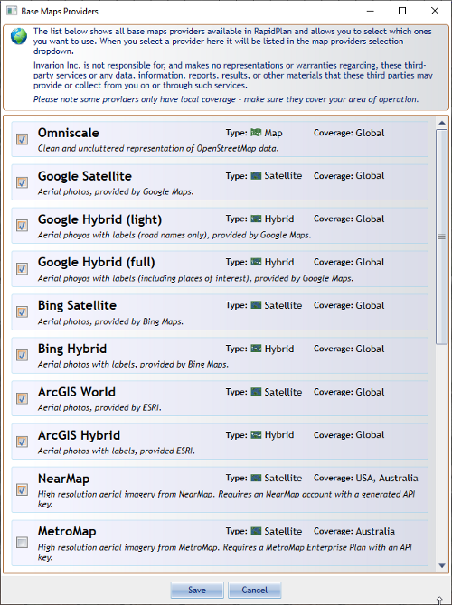

---

sidebar_position: 3

---
# Base Map Provider

Eight base map providers are available to all RapidPlan users. These are:

1. **Omniscale** - Street view, provided by Omniscale
2. **Google Satellite** - Satellite imagery, provided by Google
3. **Google Hybrid (light)**- Satellite imagery with street names and annotations, provided by Google
4. **Google Hybrid (full)** - Satellite imagery with street names, annotations and road outlines, provided by Google
5. **Bing Satellite** - Satellite imagery, provided by Bing
6. **Bing Hybrid** - Satellite imagery with street names and annotations, provided by Bing
7. **ArcGIS World** - Satellite imagery, provided by Esri
8. **ArcGIS Hybrid** - Satellite imagery with street names and annotations, provided by Esri

There's also a number of region-specific mapping providers available in the software, depending on which country version you have access to.

To view these additional mapping providers, go to the  **Base map**  section of the Properties palette. Select the  **Provider**  dropdown menu. Click  **More providers...**. In the dialogue box (displayed in Figure 14.3), check the providers you want to use. These will then become visible in the dropdown menu.

**Please note**: Access to content from NearMap and Metromap (both available to users in USA, Australia and New Zealand) requires a paid subscription to those services.

